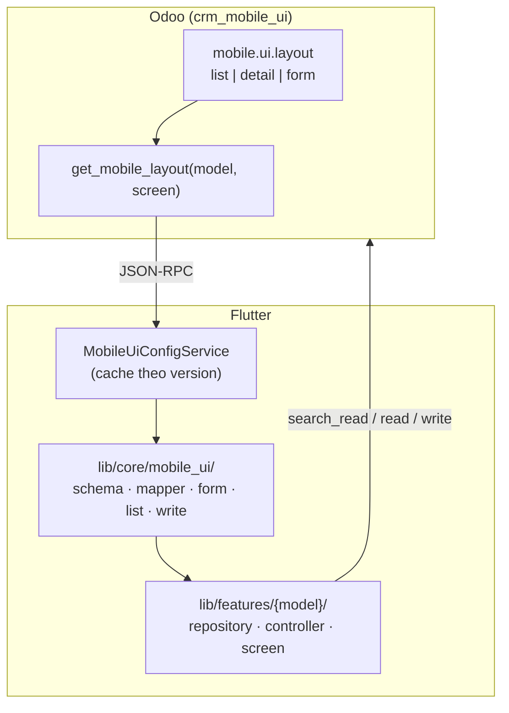

# Hướng dẫn tổng quát: Màn hình Mobile UI (server-driven)

Tài liệu này mô tả **cách làm chuẩn** để thêm hoặc mở rộng màn hình Flutter CRM theo layout cấu hình trên Odoo (addon `crm_mobile_ui`). Màn **Leads** (`crm.lead`) là implementation mẫu — các model khác (đơn hàng, liên hệ, v.v.) làm theo cùng quy trình.

## Tóm tắt kiến trúc



**Nguyên tắc:** Layout (section, field, widget) chỉnh trên Odoo — **CRM → Configuration → Mobile App UI**. App Flutter đọc layout rồi render; không cần build lại app khi đổi field hiển thị (trừ khi thêm loại field/widget mới chưa hỗ trợ).

---

## Bốn loại màn hình (`screen`)

| `screen` | Mục đích | Flutter dùng gì | Odoo RPC |
|----------|----------|-----------------|----------|
| `list` | Danh sách + thẻ card | `MobileUiListDisplay` + widget card feature | `search_read` với `fields` = tất cả field trong layout |
| `detail` | Xem chi tiết (read-only) | `MobileUiSchemaMapper` → `OdooDetailSection` | `read` theo field layout `detail` |
| `form` | Sửa bản ghi | `MobileUiFormBuilder` + `MobileUiFieldRenderer` | `read` (nạp form) + `write` qua `MobileUiWriteCoercer` |
| `create` | Tạo bản ghi mới | `MobileUiFormBuilder` (values rỗng + defaults) | `create` qua `buildCreateValuesFromMap` |

**Lưu ý:** `detail` và `form` là **hai layout riêng** — detail có thể nhiều field read-only; form chỉ gồm field cho phép sửa.

Fallback khi layout trống (`version: 0`, không section):

- `detail`: parse form XML qua `get_views` nếu `AppConfig.mobileUiFallbackToFormXml = true`
- `form`: form legacy hardcoded trong `edit_lead_screen.dart`
- `create`: fallback layout `form`, rồi form legacy trong `create_lead_screen.dart`
- `list`: danh sách field cố định trong repository (xem `_listFields` trong `lead_repository.dart`)

---

## Phần 1 — Odoo: Thêm layout cho model mới

### Bước 1: Layout mặc định (data XML)

Tạo file trong `odoo_addons/crm_mobile_ui/data/`, ví dụ `{model}_default_layouts.xml`, theo mẫu [`crm_lead_default_layouts.xml`](../odoo_addons/crm_mobile_ui/data/crm_lead_default_layouts.xml):

1. **Một record `mobile.ui.layout` active** cho mỗi cặp `(model_name, screen)`.
2. **Section** (`mobile.ui.section`) — nhóm trên UI (Contact, Address, …).
3. **Field** (`mobile.ui.field`) — `field_name` trùng tên field Odoo.

**List layout — flags đặc biệt:**

| Flag trên `mobile.ui.field` | Ý nghĩa |
|----------------------------|---------|
| `list_primary` | Tiêu đề thẻ (một field) |
| `list_subtitle` | Dòng phụ (một field) |
| Các field còn lại | Dòng icon + text trên card (`MobileUiListDisplay.lines`) |

**Widget gợi ý:** `text`, `phone`, `email`, `datetime`, `many2one`, `stage`, `priority`, … (app map sang icon/format).

### Bước 2: Khai báo trong manifest

Thêm file data vào `__manifest__.py` của `crm_mobile_ui`. Sau khi sửa data mặc định, tăng version module hoặc thêm migration (`migrations/17.0.x.x.x/post-migrate.py`) để sync layout đã deploy và bump `version` trên layout (Flutter cache theo `version`).

### Bước 3: Cài / nâng cấp addon

```bash
docker compose exec odoo odoo -u crm_mobile_ui -d <db> --stop-after-init
docker compose restart odoo
```

### Bước 4: Kiểm tra API

Gọi `mobile.ui.layout.get_mobile_layout('<model>', 'list'|'detail'|'form')` — JSON mẫu đầy đủ: [`data/reference/`](../odoo_addons/crm_mobile_ui/data/reference/README.md).

**Quyền:** user chỉnh layout cần nhóm **Mobile UI / Manager**.

---

## Phần 2 — Flutter: Feature mới theo mẫu Leads

Cấu trúc feature-first (tham chiếu `lib/features/lead/`):

```
lib/features/{feature}/
├── domain/          # model tóm tắt + view DTO (schema + values)
├── data/            # repository: layout + RPC
├── application/     # Riverpod AsyncNotifier
└── presentation/    # screens + card widget
```

### Checklist từng layer

#### 1. Repository (`*_repository.dart`)

| Việc cần làm | Tham chiếu Leads |
|--------------|------------------|
| Hằng `static const model = '...'` | `crmLeadModel` |
| `loadListLayout()` / `loadFormLayout()` / `loadCreateLayout()` | `_loadMobileLayout('list'/'form'/'create')` |
| List: `search_read` với `fields` từ layout hoặc fallback | `_fetchRemote` |
| Detail: `_resolveDetailSchema()` → `detail` layout hoặc `get_views` | `_resolveDetailSchema` |
| Edit load: `read` theo field **form** layout | `fetchLeadEditViewData` |
| Write: `buildWriteValuesFromMap` + `MobileUiWriteCoercer` | `updateLeadFromValues` |
| Create: `buildCreateValuesFromMap` + `createLeadFromValues` | `create_lead_screen.dart` |

Inject `MobileUiConfigService` qua provider (đã có `mobileUiConfigServiceProvider`).

```dart
Future<MobileUiLayoutSchema> _loadMobileLayout(String screen) {
  return _mobileUiConfig.loadLayout(
    model: yourModel,
    screen: screen,
    companyId: _sessionStore.current.companyId,
  );
}
```

#### 2. Domain

- **List item:** domain object + `Map<String, dynamic> values` (raw Odoo cho card).
- **Detail/Edit view:** DTO gồm `summary`, `OdooFormSchema schema`, `Map<String, dynamic> values` (giống `LeadDetailViewData`).

#### 3. Controller (Riverpod)

- `AsyncNotifierProviderFamily` cho detail/edit theo `id`.
- List: `Notifier` hoặc `AsyncNotifier` với filter/query.
- Bắt `OdooException.isSessionExpired` → `authSessionService.expire()` (copy từ `lead_detail_controller.dart`).

#### 4. Presentation — List

```dart
// Trong card widget
MobileUiListDisplay.primaryTitle(layout, values);
MobileUiListDisplay.subtitle(layout, values);
MobileUiListDisplay.lines(layout, values);
```

Load layout một lần trong repository khi fetch list (Leads gộp trong `_fetchRemote`).

#### 5. Presentation — Detail

- Body: lặp `view.schema.displayGroups` → `OdooDetailSection` (Leads đã làm trong `lead_detail_screen.dart`).
- Phần **không** thuộc mobile layout (chatter, tab custom): widget riêng bên dưới sections (ví dụ `LeadChatterCard`).

#### 6. Presentation — Form (Edit)

Pattern trong `edit_lead_screen.dart`:

1. `initState`: `repo.loadFormLayout()` → `_useMobileForm = layout.isConfigured`.
2. Load record: `fetch*EditViewData(id)` (dùng layout **form**).
3. Nếu mobile form: `MobileUiFormBuilder` + `MobileUiFormContext` (many2one search, dropdown tĩnh như `stage_id`).
4. Submit: `repo.update*FromValues(id, _formValues)` → repository coerce + `write`.
5. Nếu không có layout: giữ **legacy form** (controllers cố định) làm fallback.

`MobileUiFormContext` truyền:

- `relationSearch`: gọi `OdooRelationSearchService` cho many2one động.
- `staticMany2oneOptions`: map `fieldName → [(id, name)]` khi không search RPC (ví dụ stage).

#### 7. Router & l10n

- Thêm route trong `app_router.dart` / `routes.dart`.
- Chuỗi UI trong `lib/l10n/`.

#### 8. Mock offline (`useRealApi = false`)

Copy JSON layout vào:

```
assets/mock/mobile_ui_{model_with_underscores}_{screen}.json
```

Ví dụ: `mobile_ui_crm_lead_list.json`. Khai báo trong `pubspec.yaml` nếu thêm file mới.

Record mock: `assets/mock/` hoặc loader riêng trong `OdooMockSchemaLoader`.

---

## Phần 3 — `lib/core/mobile_ui/` (dùng chung, không sửa từng feature)

| File | Vai trò |
|------|---------|
| `mobile_ui_config_service.dart` | RPC + cache; mock assets |
| `mobile_ui_schema.dart` | Parse JSON Odoo |
| `mobile_ui_schema_mapper.dart` | Layout → `OdooFormSchema` (detail) |
| `mobile_ui_list_display.dart` | Card list |
| `mobile_ui_form_builder.dart` | Form theo section |
| `mobile_ui_field_renderer.dart` | Widget theo `type` / `widget` |
| `mobile_ui_write_coercer.dart` | Giá trị form → Odoo `write` |
| `mobile_ui_form_context.dart` | Context many2one / dropdown |

Provider tiện ích: `mobileUiLayoutProvider((model, screen))`.

**Cache layout:** theo `model|screen|companyId` và `version`. Sau khi admin sửa layout trên Odoo, user cần **đăng xuất/đăng nhập** hoặc gọi `MobileUiConfigService.clearCache()` để thấy bản mới.

---

## Field types & giới hạn hiện tại

### Hỗ trợ trên mobile

| Odoo type | Detail | Form | Ghi chú |
|-----------|--------|------|---------|
| char, text, html | ✓ | ✓ | |
| integer, float, monetary | ✓ | ✓ | |
| boolean | ✓ | ✓ | |
| date, datetime | ✓ | ✓ | |
| selection | ✓ | ✓ | |
| many2one | ✓ | ✓ | Searchable hoặc dropdown tĩnh |
| many2many | read-only (comma/chips) | chỉ với widget `tags` | |
| many2many + widget `tags` | chip | multi-select + `write` `[(6,0,ids)]` | vd. `tag_ids` → `crm.tag` |
| one2many | read-only label | bỏ qua khi write | |

### Widget overrides (`mobile.ui.field.widget`)

`stage`, `priority`, `phone`, `email`, `url`, `html`, **`tags`** (many2many) — xem `MobileUiFieldRenderer._buildWidgetOverride`.

`tag_ids`: cấu hình trên Odoo với widget **Tags**; app enrich ID → tên qua `OdooMany2manyEnricher`, edit dùng `TagsField`.

### Chưa hỗ trợ / làm thủ công

- Tạo tag mới trên mobile; many2many generic (không phải widget `tags`)
- Chatter (`message_*`, `activity_*`) — widget riêng ngoài layout
- One2many lines (order lines, meetings, …)

Chi tiết JSON mẫu: [odoo_addons/crm_mobile_ui/data/reference/README.md](../odoo_addons/crm_mobile_ui/data/reference/README.md).

---

## AppConfig

Trong [`lib/app/constants/app_config.dart`](../lib/app/constants/app_config.dart):

| Flag | Mặc định | Ý nghĩa |
|------|----------|---------|
| `useMobileUiConfig` | `true` | Ưu tiên layout Odoo |
| `mobileUiFallbackToFormXml` | `true` | Detail fallback `get_views` khi layout rỗng |
| `useRealApi` | `true` | `false` → mock assets |

---

## Quy trình kiểm thử nhanh

1. **Odoo:** chỉnh **Mobile App UI** → lưu → kiểm tra `preview_json` / RPC.
2. **Flutter:** hot restart app; nếu layout không đổi → logout/login (xóa cache).
3. **Debug:** log `[MobileUI]` (`MobileUiDebugLog`) — layout loaded, schema source, field mismatch khi `read`.
4. **Web:** đảm bảo CORS (`crm_mobile_ui` controllers) — xem [README.md](../README.md#run-on-web-chrome--cors).

---

## Ví dụ: thêm màn `sale.order` (pseudo checklist)

**Odoo**

- [ ] `data/sale_order_default_layouts.xml` — list + detail + form
- [ ] `__manifest__.py` + `-u crm_mobile_ui`

**Flutter**

- [ ] `lib/features/order/` — repository gọi `sale.order`
- [ ] `OrderListItem` + `OrderCard` dùng `MobileUiListDisplay`
- [ ] `OrderDetailScreen` + `OdooDetailSection`
- [ ] `EditOrderScreen` + `MobileUiFormBuilder`
- [ ] Mock: `assets/mock/mobile_ui_sale_order_{list,detail,form}.json`
- [ ] Routes `/orders`, `/orders/:id`, `/orders/:id/edit`

**Tùy chọn giữ custom UI:** filter, tab trạng thái, FAB tạo mới — không bắt buộc nằm trong layout Odoo.

---

## Tài liệu liên quan

| Tài liệu | Nội dung |
|----------|----------|
| [screens/README.md](screens/README.md) | **Mô tả tính năng & thiết kế từng màn hình** (1 file / màn) |
| [design.md](../design.md) | Design spec màu sắc, typography, components |
| [README.md](../README.md) | Chạy app, CORS, flags |
| [odoo_addons/crm_mobile_ui/README.md](../odoo_addons/crm_mobile_ui/README.md) | API `get_mobile_layout` |
| [data/reference/README.md](../odoo_addons/crm_mobile_ui/data/reference/README.md) | JSON layout đầy đủ, giới hạn field |
| **Implementation mẫu** | `lib/features/lead/`, `lib/core/mobile_ui/` |
