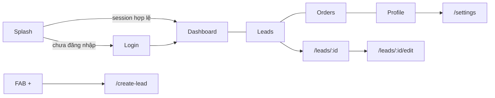

# Mô tả màn hình CRM Mobile

Tài liệu mô tả **tính năng** và **thiết kế UI** cho từng màn hình đang có trong app Flutter. Mỗi màn hình một file riêng.

Tham chiếu thiết kế chung: [design.md](../../design.md) · Kiến trúc mobile UI (server-driven): [mobile-ui-screens.md](../mobile-ui-screens.md)

## Danh sách màn hình

| Màn hình | Route | File tài liệu | Source |
|----------|-------|---------------|--------|
| Splash | `/splash` | [splash.md](splash.md) | `lib/features/auth/presentation/splash_screen.dart` |
| Đăng nhập | `/login` | [login.md](login.md) | `lib/features/auth/presentation/login_screen.dart` |
| Dashboard | `/dashboard` | [dashboard.md](dashboard.md) | `lib/features/dashboard/presentation/dashboard_screen.dart` |
| Danh sách Lead | `/leads` | [lead-list.md](lead-list.md) | `lib/features/lead/presentation/lead_list_screen.dart` |
| Chi tiết Lead | `/leads/:id` | [lead-detail.md](lead-detail.md) | `lib/features/lead/presentation/lead_detail_screen.dart` |
| Pipeline Kanban | `/leads/pipeline` | [lead-pipeline.md](lead-pipeline.md) | `lib/features/lead/presentation/lead_pipeline_screen.dart` |
| Sửa Lead | `/leads/:id/edit` | [edit-lead.md](edit-lead.md) | `lib/features/lead/presentation/edit_lead_screen.dart` |
| Tạo Lead | `/create-lead` | [create-lead.md](create-lead.md) | `lib/features/create_lead/presentation/create_lead_screen.dart` |
| Danh sách Đơn hàng | `/orders` | [order-list.md](order-list.md) | `lib/features/order/presentation/order_list_screen.dart` |
| Hồ sơ | `/profile` | [profile.md](profile.md) | `lib/features/profile/presentation/profile_screen.dart` |
| Cài đặt | `/settings` | [settings.md](settings.md) | `lib/features/settings/presentation/settings_screen.dart` |

## Điều hướng chung

Sau khi đăng nhập, app dùng **bottom navigation** 4 tab (Dashboard · Leads · Orders · Profile) và **FAB giữa** để tạo Lead mới. Chi tiết: `lib/app/router/app_shell.dart`.

